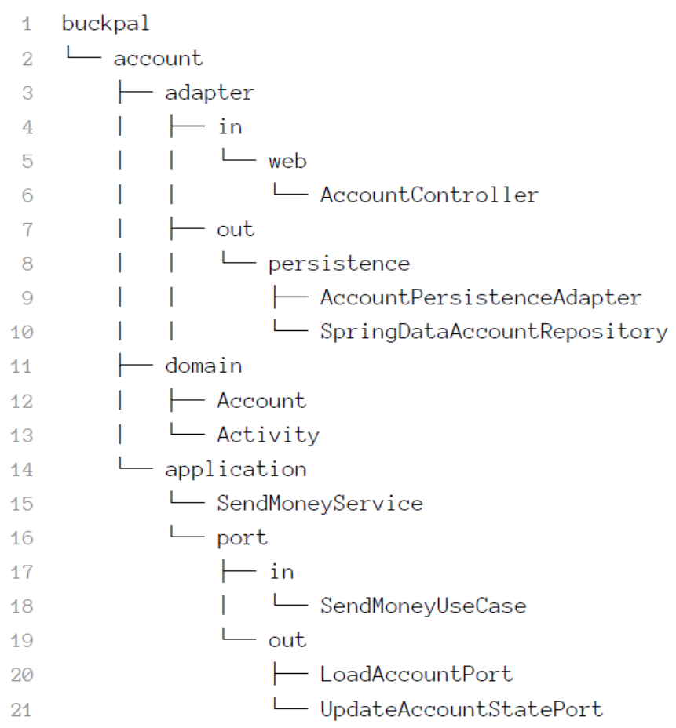
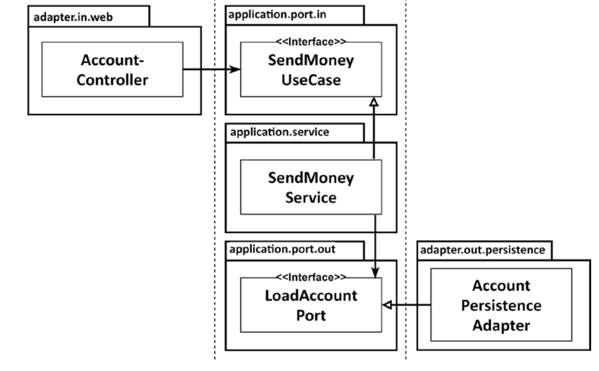

# An Architecturally Expressive Package Structure

I n a hexagonal architecture, we have entities, use cases, incoming and outgoing ports, and incoming and outgoing (or "driving" and "driven") adapters as our main architectural elements. Let's fit them into a package structure that expresses this architecture:

👆 In an architecturally expressive package structure, each architecture element has its place

* Each element of the architecture can directly be mapped to one of the packages. At the highest level, we again have a package named account, indicating that this is the module implementing the use cases around an Account.

* On the next level, we have the domain package containing our domain model.
  The application package contains a service layer around this domain model. SendMoneyService implements the incoming port interface, SendMoneyUseCase, and uses the outgoing port interfaces, LoadAccountPort and UpdateAccountStatePort, which are implemented by the persistence adapter.

* The adapter package contains the incoming adapters that call the application layers' incoming ports and the outgoing adapters that provide implementations for the application layers' outgoing ports. In our case, we are building a simple web application with the web and persistence adapters, each having its own sub-package.

🤔 Phew, that's a lot of technical-sounding packages. Isn't that confusing?

Imagine we have a high-level view of our hexagonal architecture hanging on the office wall and we are talking to a colleague about modifying a client to a third-party API
we are consuming. While discussing this, we can point at the corresponding outgoing adapter on the poster to better understand each other. Then, when we are finished talking, we sit down in front of our IDE and can start working on the client right away, because the code of the API client we have talked about can be found in the adapter/ out/<name-of-adapter> package.

Rather helpful instead of confusing, don't you think?
This package structure is a powerful element in the fight against the so-called "architecture-code gap" or "model-code gap" (Just Enough Architecture by George Fairbanks, Marshall & Brainerd, 2010, page 167). These terms describe the fact that in most software development projects the architecture is only an abstract concept that cannot be directly mapped to the code. With time, if the package structure (among other things) does not reflect the architecture, the code will usually deviate more and more from the target architecture.
Also, this expressive package structure promotes active thinking about architecture. We have many packages and have to think about into which package to put the code we are currently working on.

